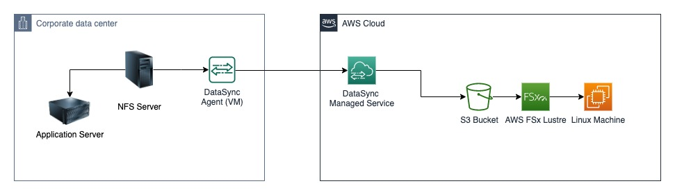
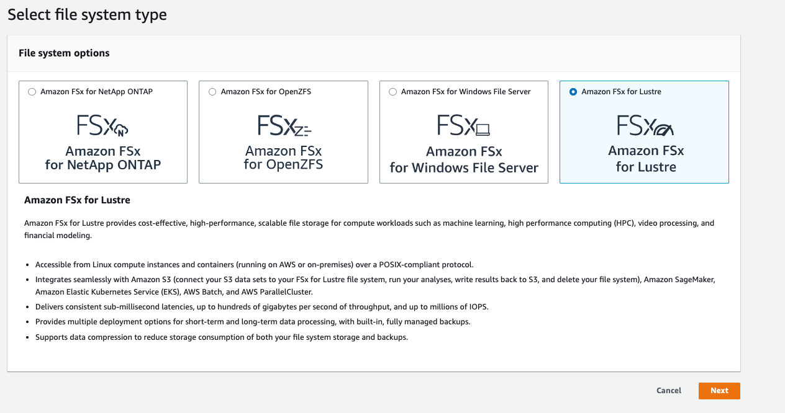
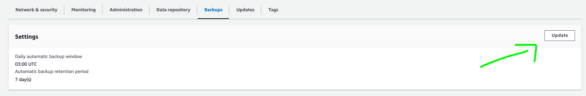
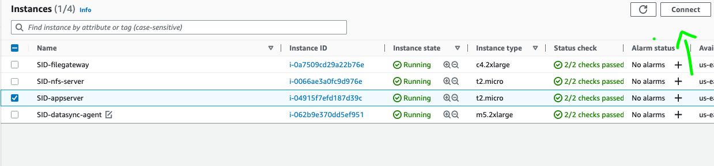
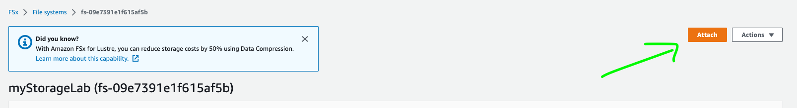

# FSx Lustre

1. Create a FSx File System
   a.  Click Create File System 
   b. Select Amazon FSx for Lustre 
   
   c.  Add File system name: myStorageLab
   d.  Select Data compression type: LZ4
   e.  Under Network & security
     - VPC: select SID-vpc
     - Security Group: select SID-ssh-sg
     - Choose the Subnet: SID-subnet1 
     - Storage capacity: 1.2 TB
       
   f. Click Next
   g. Click "Create file system"
   
2. Update "Backups" setting
   a. Navigate to [FSx File Systems](https://us-east-1.console.aws.amazon.com/fsx/home?region=us-east-1#file-systems)
   b. Click on File system ID of FSx created in Step 1
   c. Select Backup tab and Click Update
   
   d. Select "no" for Enable automatic backups
   e. Check acknowledge button and Click Save
   f. Informations:
      - File system path: `/`
      - Data repository path: S3://<bucket created in [Lab1](Migration-Lab.md)
      - No change to default settings
      - Click "Create"
   
3. Mount FSx
   A. Connect to application server
      - Navigate to [EC2 in AWS Console](https://us-east-1.console.aws.amazon.com/ec2/home?region=us-east-1#Instances:instanceState=running)
      - Connect to App Server
      
        
      

  B. Install and configure the Lustre client
     
     sudo amazon-linux-extras install -y lustre
     sudo yum -y update kernel && sudo reboot

  C. Mount your file system <br>
  - Navigate to [FSx File Systems](https://us-east-1.console.aws.amazon.com/fsx/home?region=us-east-1#file-systems)
  - Click on File system ID of FSx created in Step 1
  - Click on attach button
    
  - Connect to App Server and run the commands for Attach file system
  - Run `df-h`
  - Expected output
  ```shell 
   Filesystem                  Size  Used Avail Use% Mounted on
   devtmpfs                    484M     0  484M   0% /dev
   tmpfs                       492M     0  492M   0% /dev/shm
   tmpfs                       492M  348K  491M   1% /run
   tmpfs                       492M     0  492M   0% /sys/fs/cgroup
   /dev/xvda1                  8.0G  1.6G  6.5G  19% /
   10.11.12.172@tcp:/y6x3xbev  1.2T  7.5M  1.2T   1% /fsx
  ```

6. EXAMINE THE FILE SYSTEM - Linux Permissions
   ```shell
   ls -la /fsx/images/
   ```
