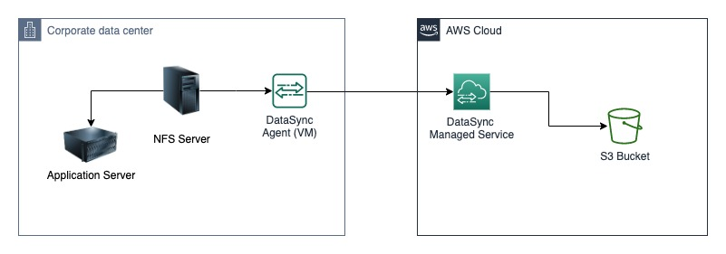

# AWS Data Migration
### Architecture



### Steps

1. Accessing the workshop account at an AWS Event
   - Click the Hash access link, accept button on the bottom right corner changes to Accept Terms & Login. Click on that button to continue. 
   - Click on "AWS Console" menu from Team Dashboard
   - From Login Link, Click "Open Console" 
    
2. Create the Lab environment from CloudFormation
   - Please Follow the Instructions [here](Create-CFN.md)
    
   - Create an S3 Bucket <br>
    1/ Navigate to [s3 in AWS Console](https://s3.console.aws.amazon.com/s3/buckets?region=us-east-1&region=us-east-1)
     
    2/ Click on Create bucket

    3/ General Configuration:
       - Bucket name: $company-hpc-$anyuniquename
       - Don't change any other option
       - Create bucket
    
3. Navigate to [EC2 in AWS Console](https://us-east-1.console.aws.amazon.com/ec2/home?region=us-east-1#Instances:instanceState=running)
   
   
4. Update security group for EC2 instances to allow HTTP and Lustre Access:
   - Navigate to [security groups](https://us-east-1.console.aws.amazon.com/ec2/home?region=us-east-1#SecurityGroups:)
   - Select Security Group - "SID-ssh-sg"
   - Edit Inbound Rules:
     
     
   - Add 2 new rules (For HTTP and Lustre)
     - Type: HTTP, Source: Anywhere-IPV4
     - Type: Custom TCP, Port: 988 Source: Custom and Select security group myStorageWorkshop-* 
5. Connect to NFS EC2 server through AWS Session Manager
   - Click on Connect from EC2 AWS Console
    
   
   - Select Session Manager
    
     
   - Find available NFS shares (We need this information to setup datasync)
    ```shell
    showmount --exports
    ```
   Expected output:
   ```shell
    Export list for ip-10-11-12-141.ec2.internal:
    /media/data *
   ```
6. DataSync Configuration
   
   - Create a DataSync Agent <br>
    1/ Navigate to [Datasync Agent in AWS Comsole](https://us-east-1.console.aws.amazon.com/datasync/home?region=us-east-1#/agents)
     
    2/ Click "Create agent"
     
    3/  Choose Amazon EC2 as Hypervisor
   
    4/ Copy amd paste public IP of EC2 instance(SID-datasync-agent) to Agent address
       
    5/ Click Get Key
   
    6/ Once complete this you will see "Successfully retrieved activation key from agent"
  
    7/ Click Create Agent


   - Create DataSync Locations - S3
   1/ Navigate to [DataSync Locations](https://us-east-1.console.aws.amazon.com/datasync/home?region=us-east-1#/locations)
     
   2/ Click "Create Location"
   
   3/ Select Location Type: Amazon S3
   
   4/ Choose S3 bucket which we created in the step 2
   
   5/ Click on Autogenerate for IAM role 
   
   6/ Click Create location
   
   - Create DataSync Locations - NFS
     1/ Navigate to [DataSync Locations](https://us-east-1.console.aws.amazon.com/datasync/home?region=us-east-1#/locations)
     
     2/ Click "Create Location"

     3/ Select Location Type: Network File System (NFS)

     4/ Choose the Agent
     
     5/ Paste the private IP of SID-nfs-server from EC2 in AWS Console
        
     
     6/ Mount path:  /media/data

     7/ Click Create location

   - Create a DataSync Task
   1/ Navigate to [DataSync Tasks](https://us-east-1.console.aws.amazon.com/datasync/home?region=us-east-1#/tasks)
     
   2/ Click "Create task"
   
   3/ Configure a Source location, Choose existing location
     
   
   4/ Select NFS Server location
   
   5/Click Next

   6/ Under Configure destination location, Choose an existing location

   7/ Select S3 location
   
   8/ Task Name: MyDataSync-Lab-Task

   9/ No Changes in any other configuration
   
   10/ Click Next

   11/ Click Create Task
   
   12/ Start the Task with Defaults
   
   
7/ Monitor Task Progress 
   - Navigate to [DataSync Task History](https://us-east-1.console.aws.amazon.com/datasync/home?region=us-east-1#/history) to see the Logs
   - Click Execution ID of the Task
   - Click on View logs in CloudWatch
   - Select latest Log streams from list
   - you should have a log entry as below
   ```shell
    [INFO] Execution exec-1232 finished with status Success.
   ```
